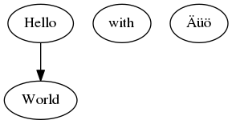

# Introdução

## Introdução

* Tópico nível 1
  + Tópico nível 2
    - Tópico nível 3

## Bloco

* Blabla
  \note{Nota Bla Bla}

### Bloco Teste
Bla bla bla bla

## Duas colunas

[columns]

[column=0.5]

~~~~python
    if __name__ == "__main__":
        print "Hello World"
~~~~

Conforme Figura \ref{lstpreprocess}

~~~~{.python .numberLines caption="The preprocessing step" label=lstpreprocess}
def myfunction(var):
  """ Oh how awesome this is. """
  pass
~~~~

~~~~{.C .numberLines caption="This is a caption"}
int main(){
  return 0;
}
~~~~

[column=0.5]

This is how a "Hello World" looks like in Python

```Pseudo
int main(){
  return 0;
}
```

[/columns]

## Código em uma página

```{.Pseudo caption="This is a Pseudo"}
int main(){
  int a, b = 0;
  int f =  a + b;
  return 0;
}
```

## Citações

Segundo [@2014:PCC:2935593] [@nvidia:maxwell]



Conforme foi apresentado na Figura \ref{mylabel}.

# Seção 2

## Exemplo de Código

```c
  /*
   * cHelloWorld.c
   *
   */
  #include <stdio.h>

  int main() {
      printf("Hello World from C  :-)\n");
      return 0;
  }
```

## Hello World

* Bla

## Estrutura de um programa em CUDA

* Bla
+ Bla bla
- bla

## Saída de Terminal {.fragile .allowframebreaks}

[terminal]
rogerio@chamonix:hello-world$  ./hello-world.exe
Hello World!!!
Teste
Teste2
teste3
rogerio@chamonix:hello-world$
[/terminal]

## Organizando as Threads

## Lançando a execução de um kernel

# Modelo de Memória, Tipos de Alocações e UVA

# Paralelismo Dinâmico

# Recursos para o uso de Multi-GPUs

# Perfilamento e Depuração

## NVIDIA Profiler: **nvprof**

## Referências
\normalsize

LOUDEN, Kenneth C. Compiladores: princípios e práticas. São Paulo, SP: Thomson, c2004. xiv, 569 p. ISBN 8522104220.


